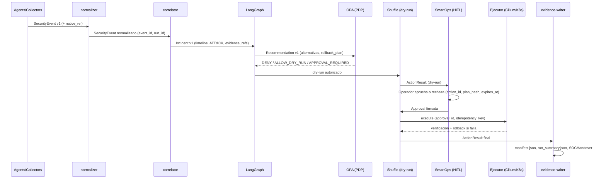

# Flujo ejecutable de extremo a extremo

Secuencia autoritativa (documento maestro v0.5, 6.2.1). El agente (LangGraph/vLLM) nunca accede directamente a Kubernetes, identidades o red: toda acción atraviesa contratos versionados, gateway MCP, policy decision, aprobación HITL y un ejecutor SOAR.

1. Los sensores publican `SecurityEvent v1` y referencias al payload nativo; el normalizador valida schema, deduplica y asigna `event_id`/`run_id`.
2. Los adaptadores de activos, SBOM y vulnerabilidades publican `AssetSnapshot` y `VulnerabilityFinding`; las fuentes CTI se consumen desde snapshots MISP/ATT&CK/KEV/EPSS fijados.
3. El correlador crea `Incident v1` con timeline, entidades, técnicas ATT&CK, severidad y `evidence_refs`; **no convierte una inferencia en hecho**.
4. LangGraph recibe un `Incident` inmutable, consulta runbooks y produce `Recommendation v1` con alternativas, impacto, incertidumbre y `rollback_plan`.
5. OPA evalúa `subject`, `tool`, `action`, `target`, entorno, clasificación y `policy_version`; devuelve `DENY`, `ALLOW_DRY_RUN` o `APPROVAL_REQUIRED`.
6. Shuffle ejecuta únicamente el dry-run autorizado y devuelve `ActionResult`; SmartOps muestra al operador evidencia, dependencias afectadas y resultado de la simulación.
7. El operador autenticado aprueba o rechaza. La aprobación incluye `action_id`, hash del plan, rol, motivo y `expires_at`; cualquier modificación invalida la firma.
8. El ejecutor aplica una `CiliumNetworkPolicy` temporal o scale-to-zero limitado al cyber-range, verifica el efecto y realiza rollback ante fallo o kill switch.
9. OpenTelemetry y el evidence writer cierran `manifest.json`, `run_summary.json` y `SOCHandover`; el gate de release valida AC01-AC14.

Contratos involucrados en cada paso: ver `../../compatibility/contracts.yaml`.
