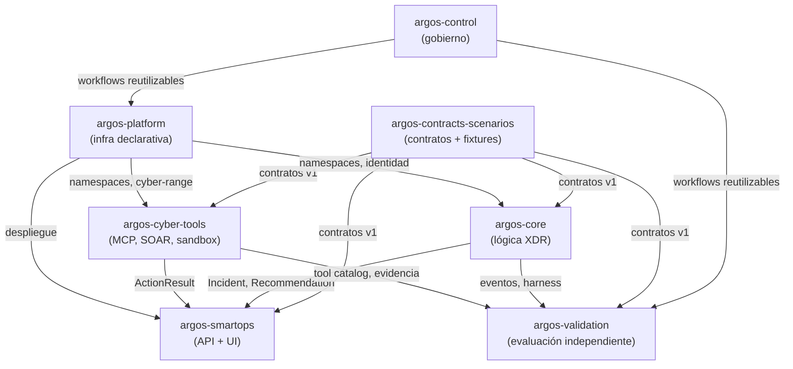

# Diagrama — topología de repositorios

Ver también `../../docs/architecture.md` (misma vista, contexto de `argos-control`) y ADR-014.

Orden de construcción: `argos-control` → `argos-platform` → `argos-contracts-scenarios` → `argos-validation` → `argos-core` → `argos-cyber-tools` → `argos-smartops`.
