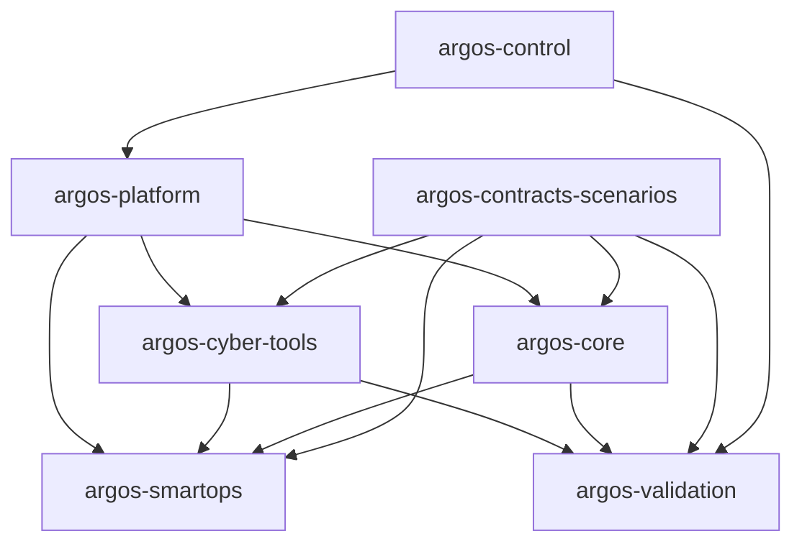

# Arquitectura de argos-control

`argos-control` es metadatos y gobierno, no runtime. No tiene diagrama de despliegue propio: consume y publica la arquitectura autoritativa de toda la organización `argos-ai-xdr` en `../architecture/`.

## Relación con los demás repositorios

`argos-control` no depende de ningún otro repositorio (`dependencies: []` en `repository.yaml`); todos los demás lo consumen para workflows reutilizables, ADR de referencia y el release manifest.

## Dónde vive cada cosa

| Pregunta | Dónde |
| --- | --- |
| ¿Qué decisión de arquitectura se tomó y por qué? | `../adr/` |
| ¿Cómo se despliega la plataforma? | `../architecture/deployment/` y el repo `argos-platform` |
| ¿Qué zonas de confianza existen? | `../architecture/trust-zones/` |
| ¿Cómo fluyen los eventos entre servicios? | `../architecture/data-flows/` |
| ¿Qué versión de cada repo forma una release? | `../releases/` |
| ¿Qué contratos son compatibles entre sí? | `../compatibility/` |
